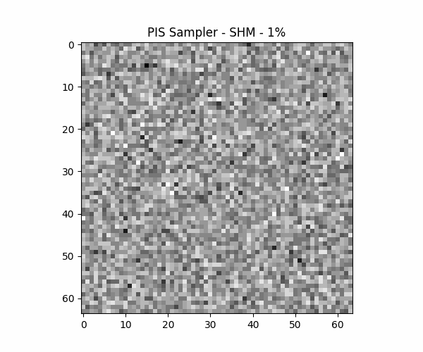
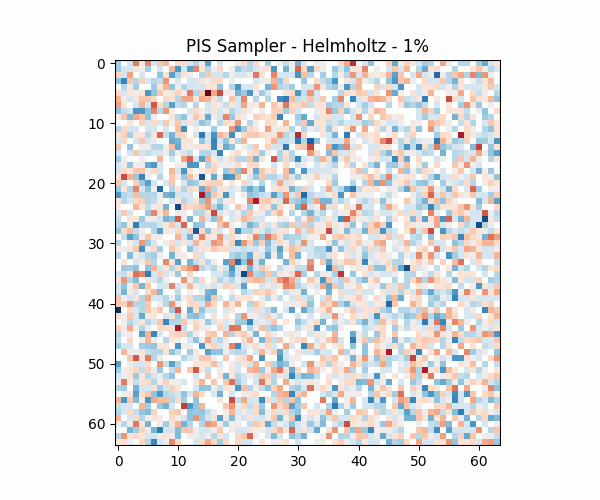

# PIS: A Generalized Physical Inversion Solver for Arbitrary and Sparse Observations via Set-Transformer Conditioned Flow Matching

This repository contains the official PyTorch implementation of the paper **"PIS: A Generalized Physical Inversion Solver for Arbitrary and Sparse Observations via Set-Transformer Conditioned Flow Matching"**.  

The Physical Inversion Solver (PIS) is a unified, knowledge-based generative framework that addresses the fundamental trilemma between flexibility, efficiency, and stability in PDE-constrained inverse problems. By natively treating sensor data as permutation-invariant sets, PIS elegantly circumvents the grid-dependency of previous models.  

<table>
  <tr>
    <td align="center">
      
      <br>
      <em>PIS: Darcy Flow</em>
    </td>
    <td align="center">
      
      <br>
      <em>PIS: Helmholtz</em>
    </td>
      <td align="center">
      
      <br>
      <em>PIS: Structural Health Monitoring</em>
    </td>
  </tr>
</table>


## 🌟 Key Highlights

- **Robust Generalization Under Extreme Sparsity:** Employs an effective Cosine-Annealed Sparsity Curriculum (CASC) training strategy to prevent catastrophic posterior collapse, even under extreme <1% observation coverage.  
- **Arbitrary Sensor Layouts:** Utilizes an innovative Set-Conditioned Flow Matching architecture to natively support arbitrary and off-grid sensors without heuristic interpolations.  
- **Real-Time Inference Efficiency:** Leverages deterministic, straight-path transport to achieve instantaneous inference, offering an over 4x speedup compared to diffusion baselines.  
- **Information-Based Optimization:** Provides rigorous uncertainty quantification (UQ) and serves as a data-driven tool for evaluating Shannon Entropy, guiding optimal sensor placement in engineering applications.  

------

## Project Structure

Plaintext

```
.
├── data/
│   ├── darcy/          # Fortran & MATLAB scripts for Darcy Flow
│   ├── helmholtz/      # Downloader for Helmholtz dataset
│   └── shm/            # Python FEM scripts for SHM
├── models/
│   ├── model.py                # Set-Conditioned U-Net Backbone
│   ├── denoise_unet.py         # Sub-modules of Set-Conditioned U-Net Backbone
│   ├── encoder_net.py          # Sub-modules of Set-Conditioned U-Net Backbone
│   └── FM.py    # Flow Matching Framework
├── functions/
│   ├── data.py             # Dataloader module
│   ├── helper.py           # Helper functions for sampling and training
│   └── trainer.py          # Training Pipeline
├── Experiments/
│   ├── Field Sampler.py             # Sampling Notebook (Inversion Inference)
│   ├── Exp_Information.py           # Experiments: Information Theory
│   ├── Exp_Noise_Arb.py             # Experiments: Robustness to Noise
│   ├── Exp_testset_predicts.py      # Experiments: Testset Predicts
│   ├── Exp_UQ.py                    # Experiments: Uncertainty Quantification
│   └── outputs                      # Sampling results for Darcy Flow
├── output/               # Checkpoints saved here
├── main.py                 # Entry point for training
├── requirements.txt        # Dependencies
└── README.md
```

------

## 🏗️ Architecture

PIS operates on a **Set-Conditioned Transformer U-Net (SCTU-Net)**.  

- **Set Encoder:** A Set Transformer with Induced Set Attention Blocks (ISAB) encodes raw unstructured observations into latent features.  

- **Dual-Path Streams:** The architecture bifurcates to extract a Global Context via Pooling Multihead Attention (PMA) and a grid-aligned Spatial Map via cross-attention.  

- **Generative Backbone:** These set embeddings are injected into a U-Net backbone via field synthesis and adaptive group normalization to construct the deterministic probability flow.  

  

------

## 🌍 Physical Scenarios and Datasets

The framework is rigorously evaluated across three diverse PDE-governed systems:

- **Subsurface Characterization:** Estimating heterogeneous hydraulic conductivity fields from sparse measurements of hydraulic head and solute concentration, governed by steady-state Darcy flow and advection-dispersion equations.  
- **Wave-based Characterization:** Inverting spatially varying wavenumbers from partial wavefield observations, governed by the 2D Helmholtz equation (camlab-ethz benchmark).  
- **Structural Health Monitoring (SHM):** Reconstructing the Young's modulus field of a two-phase heterogeneous medium solely from sparse displacement measurements under static inverse elasticity.  

------

## 🚀 Getting Started

### Prerequisites

- Python 3.8+
- PyTorch 2.0+
- NVIDIA GPU (Experiments were conducted on a single NVIDIA A100 80GB GPU).  

### Installation

Clone the repository and install the required dependencies:

```
git clone https://github.com/RaphaelYangWJ/Physical-Inversion-Solver.git
cd Physical-Inversion-Solver
pip install -r requirements.txt
```

------

## 🏃‍♂️ Training the Model

The optimization is driven by the Adam optimizer and follows a specialized two-stage training lifecycle to effectively learn physical priors and prevent mode collapse.  

**Stage 1: Warmup** The model is trained exclusively on dense observations for 300 epochs to establish a robust global understanding of the physical field.  

**Stage 2: Cosine-Annealed Sparsity Curriculum (CASC)** The model is fine-tuned for 1000 epochs while the observation sparsity is dynamically annealed from a dense, well-posed regime down to the target ill-posed sparsity.  

To initiate training, run:

```
python train.py
```
